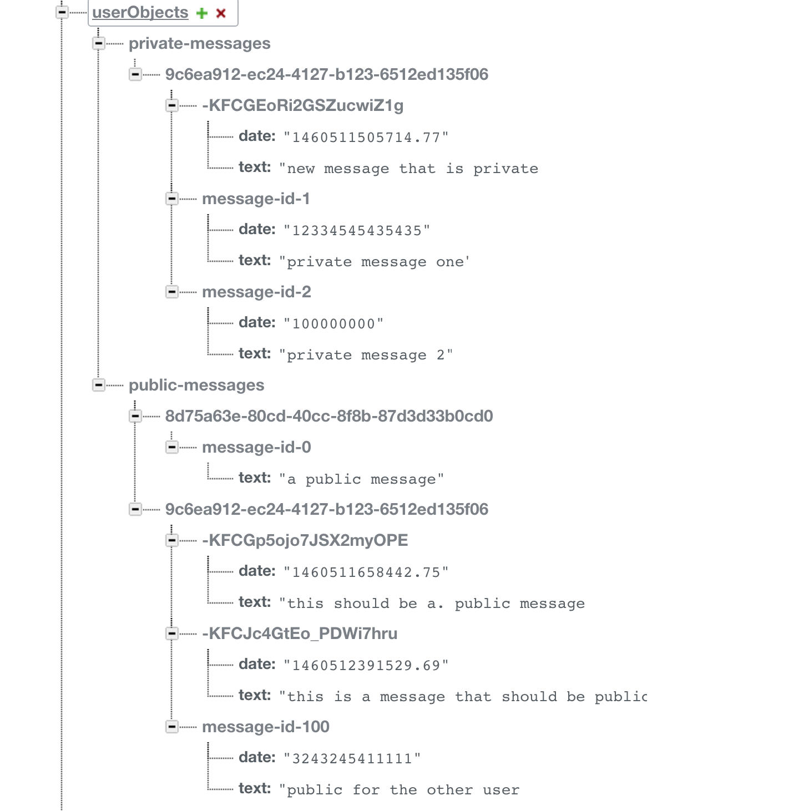

# swift-firebase-sample

Sample swift application using firebase where we demo creating private objects and use of security and rules in the application. The application also demonstrates creating a user, authentication, listing private and public object and creating them.

##### CONFIGURE WITH YOUR APP INFORMATION

after you clone the repo be sure to do a `pod install` that application is using [cocoaPods](https://guides.cocoapods.org/using/pod-install-vs-update.html)

```swift
    // file : FirebaseService.swift
    static var BASE_URL = "https://[YOUR-APP-NAME].firebaseio.com/"
```
##### FIREBASE RULES CONFIGURATION
```
{
    "rules": {
      "users": {
        "$user_id": {
          // grants write access to the owner of this user account
          // whose uid must exactly match the key ($user_id)
          ".write": "$user_id === auth.uid"
        }
      },      
     "userObjects" : {
        "public-messages" : {
          "$user_id":{
            ".read": true,
            ".write": true
          }
        },       
        "private-messages" : {
          "$user_id":{
            ".read": "$user_id === auth.uid",
            ".write": "$user_id === auth.uid"
          }
        }
      },
    }
}
```
##### SAMPLE DATA STRUCTURE

